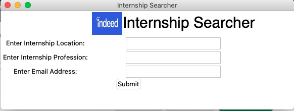

# EasyIntern

Searching for Internships on a consistent basis can be quite time-consuming and tiring. That's why I created EasyIntern, a simple and easy to use Python GUI using Tkinter. By using the GUI, students and professionals can eaily get a report of new internship postings from Indeed in the past 3 days emailed directly to their email address. Users can modify the desired profession of the internship as well the location and add custom email addresses using a simple command.

---

# Disclaimer

Only Works for Canadian Cities Right Now 
I am Working to add Capabilities to Browse Global Cities as Well

  

